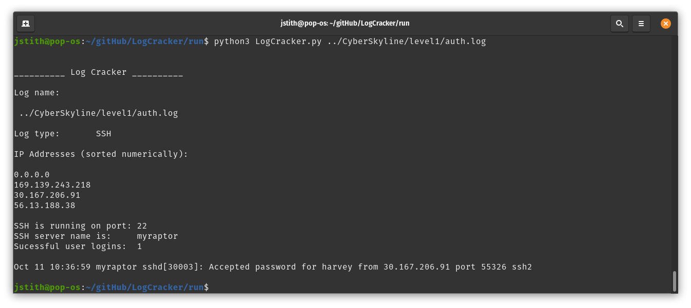

__LogCracker__
===============


By: _Jstith_

### NOTE: THIS REPO MUST STAY PRIVATE, THERE IS CYBER SKYLINE STUFF THAT MUST BE REMOVED BEFORE THIS GOES PUBLIC

## Usage

```bash
python3 LogCracker.py file.log -type SSH
```

## The Idea

In my experience with log analysis in CTFs, I find myself always following a pattern. There many different types of logs, and there are many different things we get asked about logs, but ultimately I do the same thing every time with different data. LogCracker is an attempt to streamline that process and automate pulling information from log files. What I want this to do is identify the type of log it's given, pull out basic information about that log, and present the user options and scripts to get further information based on what they need to find.

## How it Works

There are several differnt ways to go about log analysis. LogCracker follows my personal methodology, and uses a combination of python and bash scripts to manipulate the data in the log files.

## What works right now

Currently, you can run the python file with a log file passed as an arg and the program will try to identify what kind of log it is. Currently, the only working option is SSH. If the log is an SSH log, it will parse through the log and dispaly some basic information:
- What IPs are used
- What port SSH is running on
- Name of SSH server
- Successful logons



## Future Goals

- More information about logs
- User specified information about logs
- Multiple types of logs
- Generic reader to get basic infomation about any format
- Easier access to the library of shell scripts
  - I don't want this to be purely a plug and chug program, but rather a library of scripts (python and bash) with some direction on how to use them in order to speed up the process... and a plug and chug option.
- A GUI.. of course
